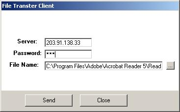



## \_\*\*P2P File Transfer Using Winsock

### Description

File Transfer Client and Server using Winsock.
 
### More Info
 

             |
---                |---
**Submitted On**   |2004-07-05 09:11:36
**By**             |[Lutfur Rahman Bhuiyan](https://github.com/Planet-Source-Code/PSCIndex/blob/master/ByAuthor/lutfur-rahman-bhuiyan.md)
**Level**          |Intermediate
**User Rating**    |5.0 (10 globes from 2 users)
**Compatibility**  |VB 6\.0
**Category**       |[Files/ File Controls/ Input/ Output](https://github.com/Planet-Source-Code/PSCIndex/blob/master/ByCategory/files-file-controls-input-output__1-3.md)
**World**          |[Visual Basic](https://github.com/Planet-Source-Code/PSCIndex/blob/master/ByWorld/visual-basic.md)
**Archive File**   |[\_\_\_P2P\_Fil176620752004\.zip](https://github.com/Planet-Source-Code/lutfur-rahman-bhuiyan-p2p-file-transfer-using-winsock__1-54772/archive/master.zip)

